<!-- MDTOC maxdepth:6 firsth1:1 numbering:0 flatten:0 bullets:1 updateOnSave:1 -->

- [Dockerfile详解](#dockerfile详解)   
   - [自制docker镜像途径](#自制docker镜像途径)   
   - [关于dockerfile](#关于dockerfile)   
   - [dockefile语法格式](#dockefile语法格式)   
   - [.dockerignore文件](#dockerignore文件)   
   - [环境变量](#环境变量)   
   - [dockerfile指令](#dockerfile指令)   
      - [FROM指令](#from指令)   
      - [MAINTANIER指令(已经废弃)](#maintanier指令已经废弃)   
      - [LABEL指令](#label指令)   
      - [COPY指令](#copy指令)   
      - [ADD指令](#add指令)   
      - [WORKDIR指令](#workdir指令)   
   - [VOLUME指令](#volume指令)   
   - [docker build制作镜像](#docker-build制作镜像)   
   - [参考](#参考)   

<!-- /MDTOC -->
# Dockerfile详解

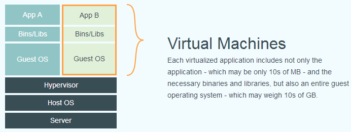

## 自制docker镜像途径

* 基于容器
  - 二次打包
* 基于dockerfile
  - 从无到有构造

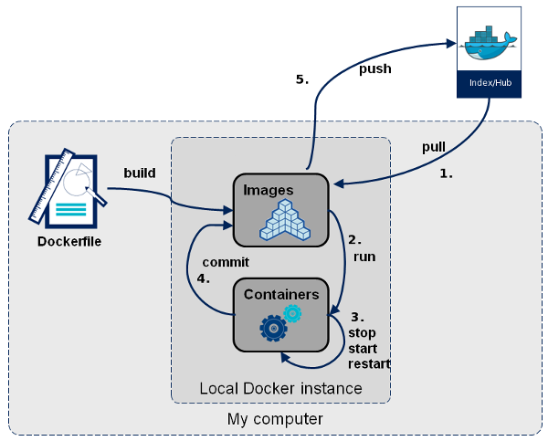

## 关于dockerfile

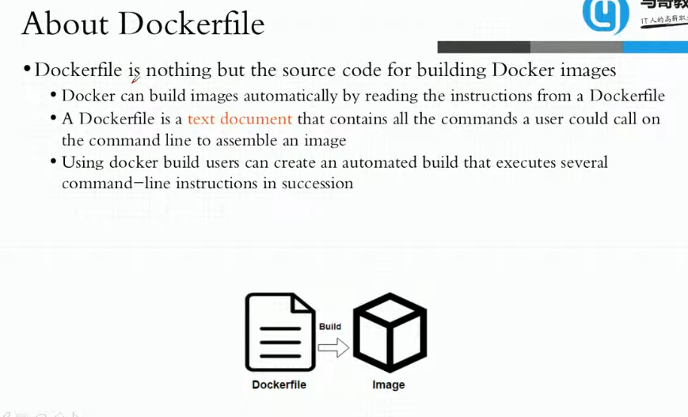


## dockefile语法格式

* dockerfile = N * [ 注释+指令及其参数 ]
* 指令本身不区分大小写，约定俗成管理，**使用大写**
* 第一条指令必须是**FROM**指令，指定镜像，基于镜像二次构造

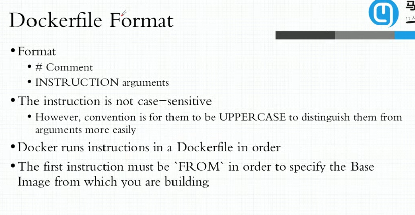


## .dockerignore文件

* 文本文件，类似.gitignore，文件排除列表，文件排除名单
* 所有在打包时的文件中，但凡写在.dockerignore文件中的文件不包含，包括.dockerignore本身
* .

## 环境变量

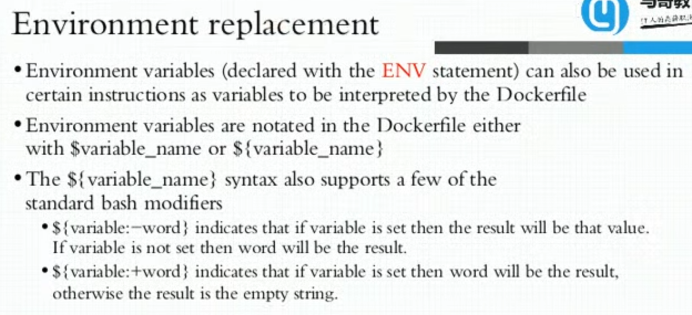

* 相似于shell环境变量，隐含if-else语句
  - ${variable:-word} : variable没有定义或者为空，则为word
  - ${variable:-word} : variable没有定义或者为空，则为word

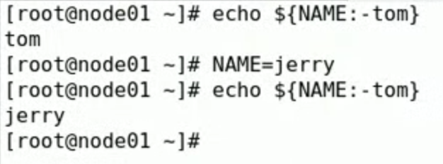

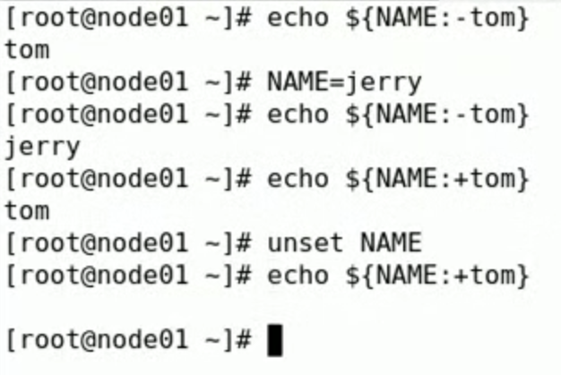


## dockerfile指令

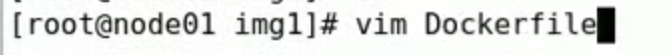

* Dockerfile创建，D要大写
* **务必惜字如金，每一条指令多一层**

### FROM指令


* 基于镜像二次构建，FROM指明基于哪个镜像
* 可以通过哈希值指定镜像

```
FROM <repository>[:<tag>]
或
FROM <repository>@<digest>
```

* tag默认为latest
* digest是镜像哈希值

实例：

```
FROM busybox:latest

或

FROM buxybox@哈希值  （建议写法，安全性更高）
```

### MAINTANIER指令(已经废弃)

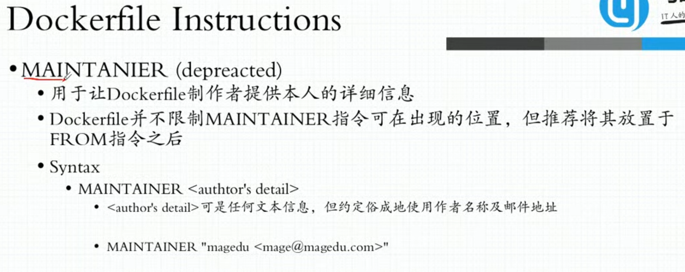

```
MAINTAINER <author's detail>
```

* 已经废弃
* 提供维护者、创始人信息，一般是名称+邮件（联系方式）


实例：

```
MAINTAINER "mageedu <mage@mageedu.com>"
```


### LABEL指令

* docker 17版之后方可使用
* 可以将Maintainer信息作为label嵌入

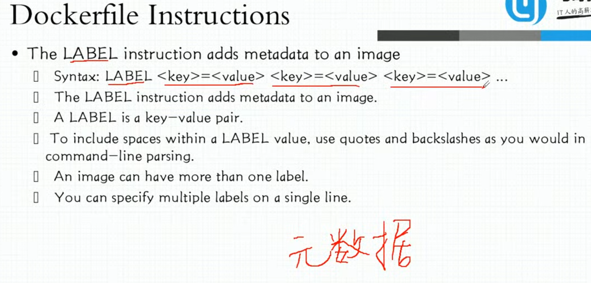


### COPY指令

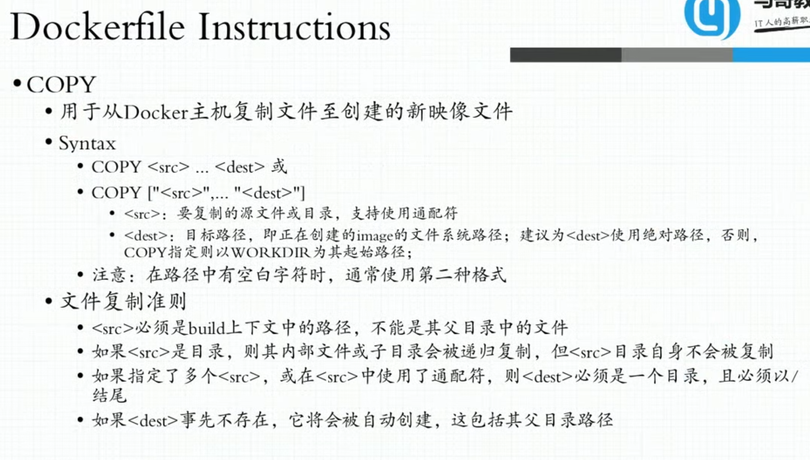

* 宿主机中的文件，打包，放到目标镜像中
* 从当前工作目录中的某个、某些文件复制到目标镜像中

```
COPY <src> ... <dest>
或
COPY [“<src>” ... “<dest>”]
```

* 类似于mv、cp命令
* src 指明需要复制的文件或目录，支持通配符，**建议相对路径**，dockerfile工作目录
* dest 目标路径，正在创建的image文件系统路径，目标镜像中存放该文件/目录的路径，**建议dest使用绝对路径**
* **文件名中有空白字符，必须用引号引用，不然会被拆分**

文件复制准则

* <src>必须是build上下文路径，不能使用父目录文件
* <src>必须存在，不存在无中生有的拷贝
* **<src>是目录，则递归复制，但是<src>目录自身不会被复制**
* 如果指定了多个<src>或者<src>使用通配符，则<dest>必须是目录，目录才能存下多目标
* <dest>事先不存在则会自动创建，包括父目录，相当于```mkdir -p```


实例：

```
COPY index.html /data/web/html/
```

build文件夹结构

```
PWD:
| - Dockerfile
| - index.html
```

### ADD指令

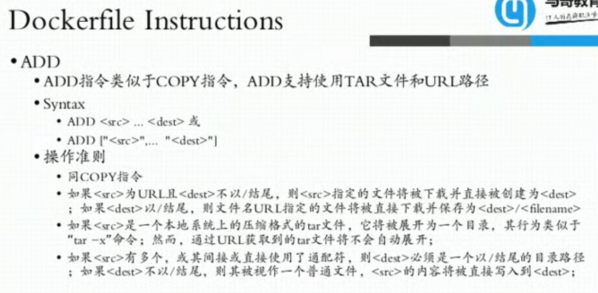

* ADD类似COPY指令，但是支持TAR文件和URL路径，相当于增强的COPY
* 如果<src>是TAR文件，可以自动解压到目录，但是**如果是URL中的tar文件，则不会被展开**

```
ADD <src> ... <dest>
或
ADD [“<src>” ... “<dest>”]
```

实例：

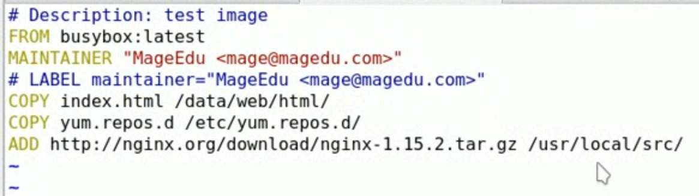

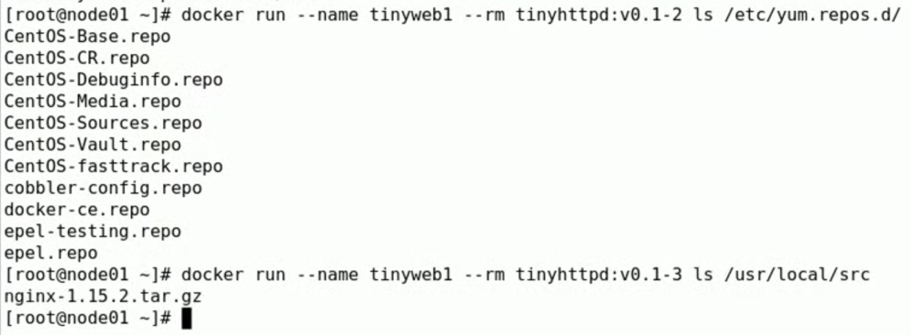

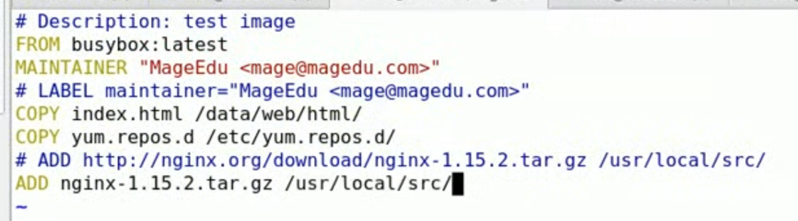

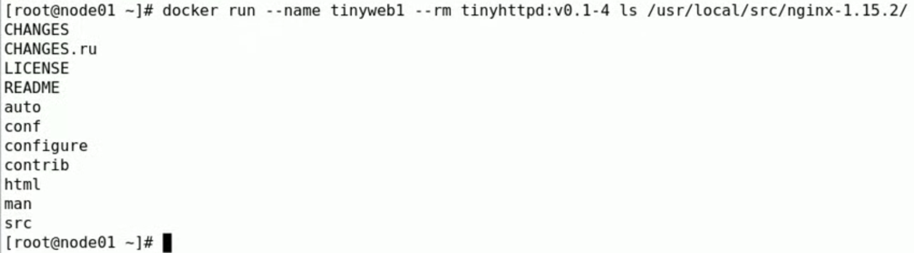


### WORKDIR指令

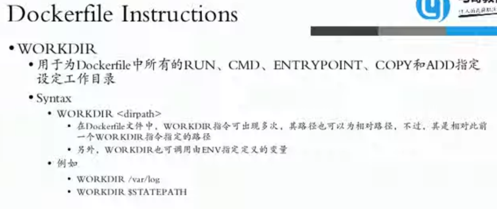

```
WORKDIR <dirpath>
```

* 每次执行路径就切换，影响从当前指令开始
* 建议为绝对路径，也可以将环境变量值作为路径

实例：

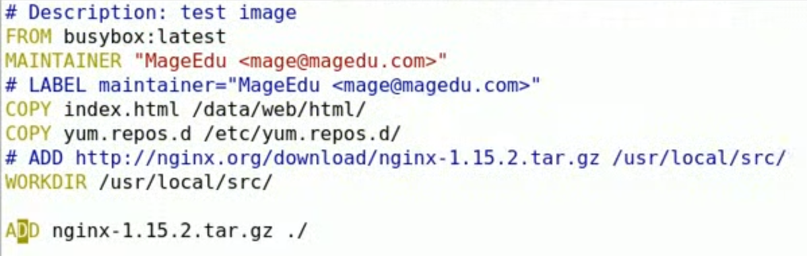

## VOLUME指令

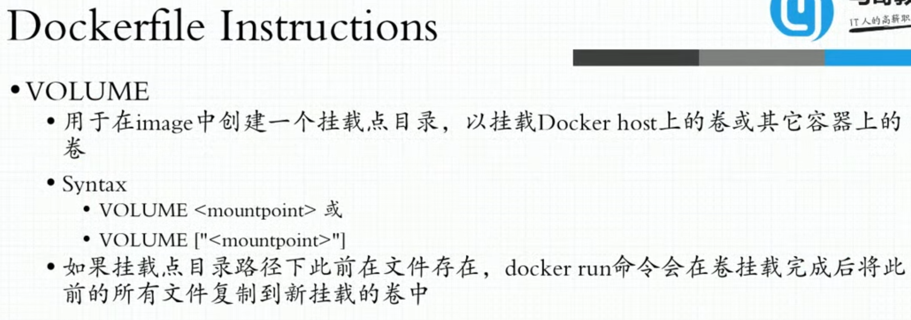

```
VOLUME <mountpoint>
或
VOLUME [“<mountpoint>”]
```


## docker build制作镜像

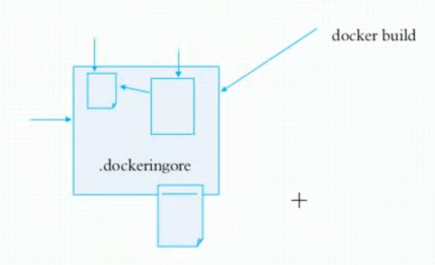

* 所有制作环境是底层镜像所能提供的，也就是说dockerfile所记录的命令，必须包含在镜像中
* 做镜像就是基于现有镜像制作

```
docker build [OPTIONS] PATH | URL | -
```


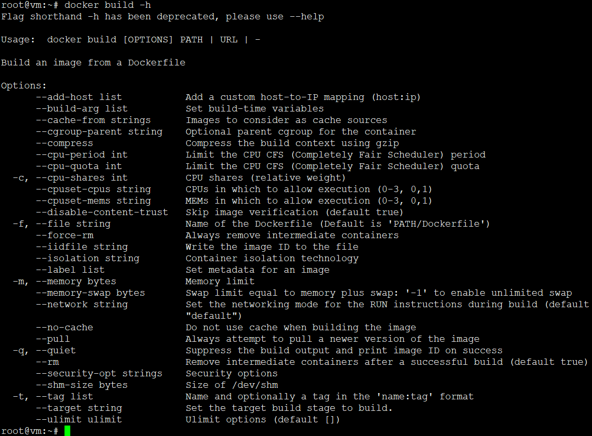

* 指明Dockerfile路径，可以直接当前目录，可以使用URL，可以使用输入重定向

实例：

```
docker build -t tinyhttpd:v0.1-1 ./
```

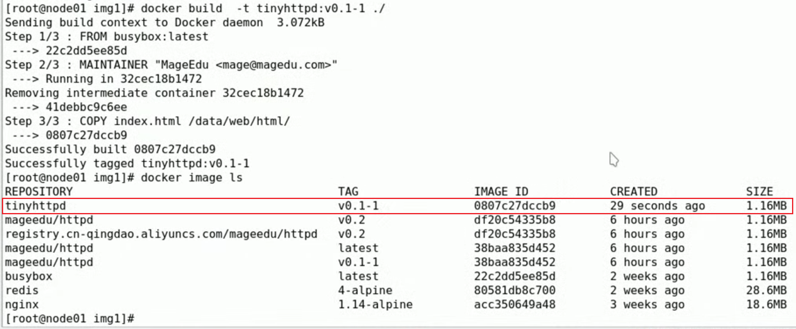

运行测试：

```
docker run --name tinyweb1 --rm tinyhttpd:v0.1-1 cat /data/web/html/index.html
```

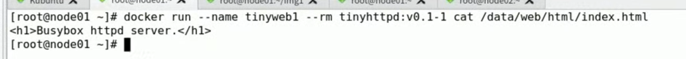

```
-i, --interactive                    Keep STDIN open even if not attached
-t, --tty                            Allocate a pseudo-TTY
--rm                             Automatically remove the container when it exits
```

实例：

```
FROM busybox:latest
MAINTAINER “MageEdu <mage@mageedu.com>”
# LAGEL maintainer="MageEdu <mage@mageedu.com>"
COPY index.html /data/web/html/
COPY yum.repos.d /etc/yum.repos.d/
```

* <src>是目录，则是复制目录中的内容，不会复制目录本身
* <dest>如果是目录必须以“/”结尾，否则会被识别为文件

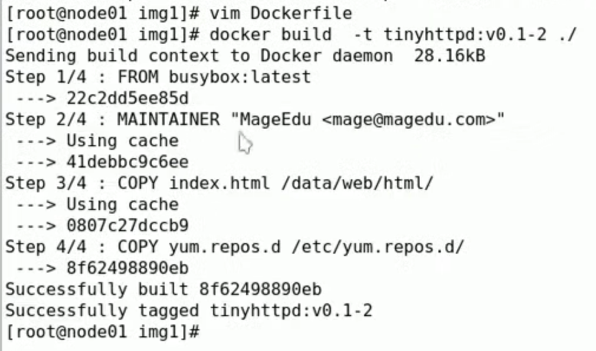

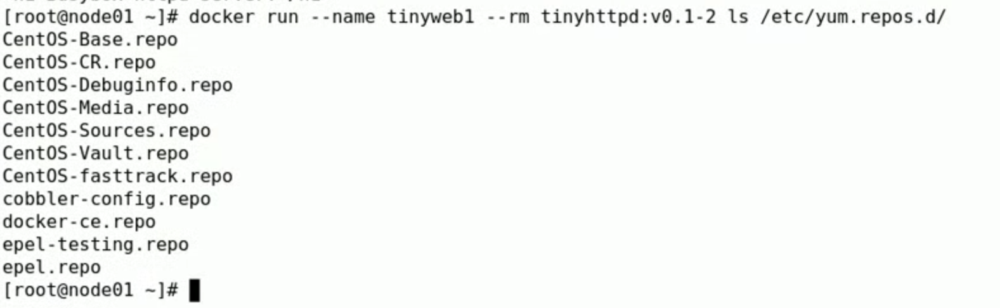


## 参考

*


---
